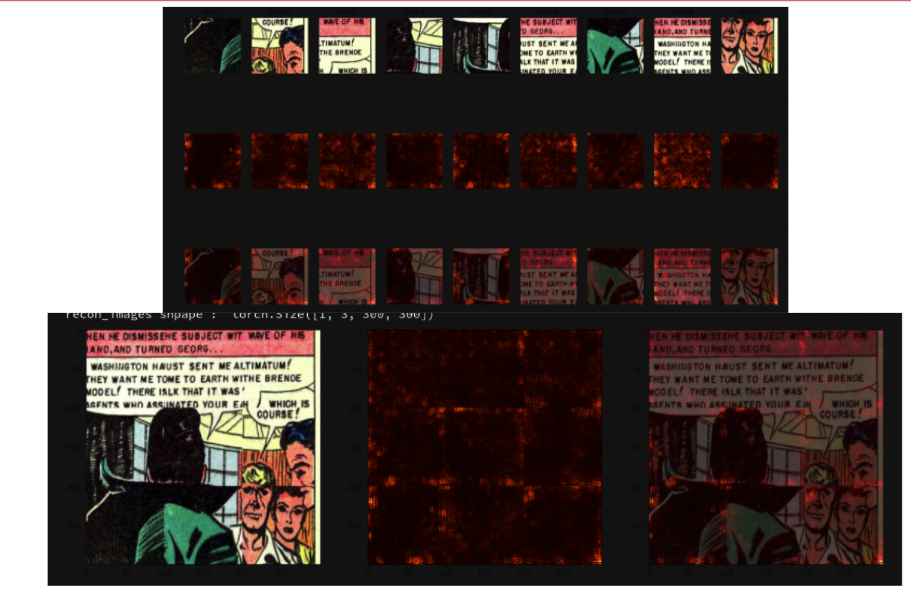

# JigsawPanel
Jigsaw Self Supervised Learning Task  for Golden Age Panels Data

## COMICS Dataset:

- [**Golden Age Comics**](https://digitalcomicmuseum.com/): Includes US comics between 1938 to 1956. The extracted panel images are used, which are retrieved through the study [The Amazing Mysteries of the Gutter](https://arxiv.org/abs/1611.05118).

## Jigsaw Task and Model 

The Reason for using Self Supervised Learnign algorithm is ,due to domain shift between comics and real pictures, current backbones that are trained on ImageNet  does not perform well on the comics domain. The goal of the project is training model using self supervised jigsaw puzzle task on the Golden Age dataset, and using weights of the trained model on the other tasks such as object detection on the comics domain. Hypothesis is model will learn representative features to solve the Jigsaw task.

The Jigsaw Puzzle solving task is a self supervision task in which you divide the images into patches. Then, you mix the patched and the model task is finding the correct ordering of the patches. The more information can be found in the paper [Unsupervised Learning of Visual Representations by Solving Jigsaw Puzzles](https://arxiv.org/abs/1603.09246)

## Saliency analysis on the Comics
Eventough model performs very well on the training dataset (nearly %98 percent training accuracy after 6 epochs), its performance on the validation set is not that good. Additionally, the weights of the backbone that is trained with Self Supervised Jigsaw Puzzle solving task does not perform good on the tasks such as Object detection. After doing saliency analysis, I have detected that the model learns to look at the border of the patches, rather than learning representative features of the comics domain to be able to solve the jigsaw puzzle task. In other words, model remembers the borders only to solve the task (overfits to training data), does not learn the structure of the comics or good features from the data, therefore can not be perform well on other tasks such as object detection.

